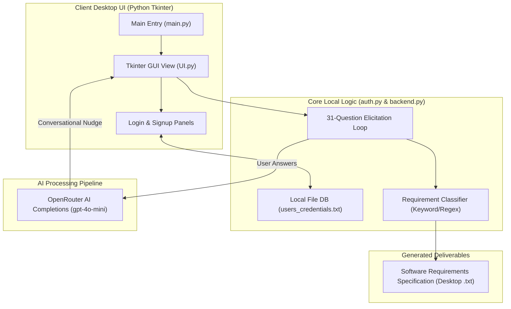
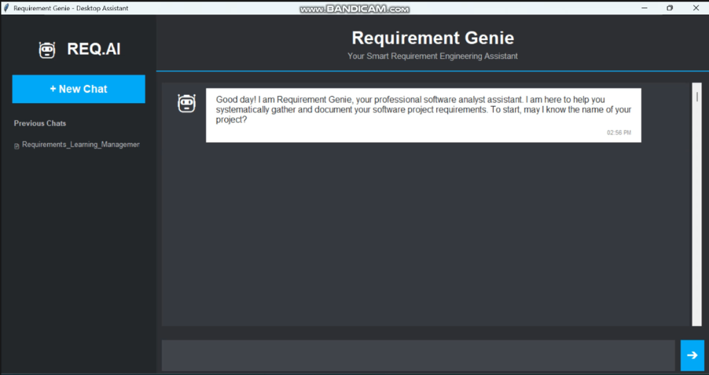

# 🧞 Requirement Genie

[](https://www.python.org/)
[](#)
[](https://openrouter.ai/)
[](https://opensource.org/licenses/MIT)

An intelligent, desktop-based software requirements elicitation assistant built in Python using **Tkinter** and powered by **OpenRouter AI API** (`gpt-4o-mini`). Requirement Genie automates the work of a Business Analyst, systematically guiding users through a structured 31-question elicitation framework, detecting out-of-scope topic shifts, classifying requirements on-the-fly, and generating standard Software Requirements Specification (SRS) documents.

---

<p align="center">
  
</p>

---

## 🗺️ Navigation Index

1. [✨ Core Features](#-core-features)
2. [🏗️ Application Architecture](#%EF%B8%8F-application-architecture)
3. [🖥️ Folder Structure Overview](#%EF%B8%8F-folder-structure-overview)
4. [🧠 Elicitation Framework & AI Pipeline](#-elicitation-framework--ai-pipeline)
5. [⚙️ Setup & Run Locally](#%EF%B8%8F-setup--run-locally)
6. [📸 Application Preview](#-application-preview)
7. [🤝 Contributing](#-contributing)

---

## ✨ Core Features

- **🗣️ Conversational AI Analyst:** Dynamically guides users through requirements gathering using natural language prompts.
- **📈 31-Question BA Framework:** Coherently covers name registration, user roles, core workflows, searches, reporting, safety constraints, performance parameters, and accessibility.
- **🏷️ Real-time Classification:** Automatically categorizes user inputs into exactly 5 folders:
  - **Business Requirements (BR)**
  - **Functional Requirements (FR)**
  - **Non-Functional Requirements (NFR)**
  - **Security Requirements (SR)**
  - **UI/UX Requirements (UX)**
- **🔄 Out-of-Scope Detection:** Uses AI to flag topic shifts (e.g., switching from a bank system to a restaurant model) and requests confirmation before proceeding.
- **📄 Live SRS Generator:** Writes structured, formatted requirements (e.g., `- FR-01 The system shall...`) directly to a desktop text document (`{Project_Name}.txt`).
- **🔏 User Authentication:** Simple desktop user signup and login panel backed by a local JSON credentials file (`users_credentials.txt`).

---

## 🏗️ Application Architecture

The system coordinates local static interfaces, data structures, and cloud completions:



---

## 🖥️ Folder Structure Overview

```text
/
├── Folder/
│   ├── main.py               # Main launcher (initializes Tkinter event loop)
│   ├── UI.py                 # Tkinter layout, chat panel, & sidebar widgets
│   ├── auth.py               # User authorization & file-based credentials mapper
│   └── backend.py            # AI OpenRouter logic, question flow, & SRS writer
├── assets/                   # Media resources
│   ├── banner.png            # Glowing tech banner
│   └── preview.png           # Desktop GUI screenshot
└── README.md                 # Interactive documentation (this file)
```

---

## 🧠 Elicitation Framework & AI Pipeline

1. **Naming:** Starts by requesting the Project Name and sets up the active SRS file on the desktop.
2. **Context Checking:** Evaluates user inputs against software development terms to prevent gibberish.
3. **AI Classification:** Attempts classification using a custom system prompt on OpenRouter. If the API key is not configured, it falls back to an optimized regex/keyword classification engine.
4. **Writing:** Format output strings to follow the industry standard (`BR-XX`, `FR-XX`, `NFR-XX`, `SR-XX`, `UX-XX`) and appends them to the desktop document in real time.

---

## ⚙️ Setup & Run Locally

### Prerequisites
- Install [Python 3.x](https://www.python.org/downloads/)
- Obtain an API Key from [OpenRouter AI](https://openrouter.ai/) (optional, falls back to local rules if not provided)

### Execution Steps
1. **Clone the repository:**
   ```bash
   git clone https://github.com/asad594/Requirement-Genie.git
   cd Requirement-Genie
   ```

2. **Install dependency libraries:**
   ```bash
   pip install requests
   ```

3. **Navigate to the source directory:**
   ```bash
   cd Folder
   ```

4. **Launch the application:**
   ```bash
   python main.py
   ```

---

## 📸 Application Preview

Here is a preview of the conversational dashboard running locally:

<p align="center">
  
</p>

---

## 🤝 Contributing
Contributions, issue reports, and feature additions are welcome!
1. Fork the project.
2. Create your feature branch (`git checkout -b feature/CoolFeature`).
3. Commit your changes (`git commit -m 'Add some CoolFeature'`).
4. Push to the branch (`git push origin feature/CoolFeature`).
5. Open a Pull Request.

---

## 📜 License
Distributed under the **MIT License**. See `LICENSE` for details.
